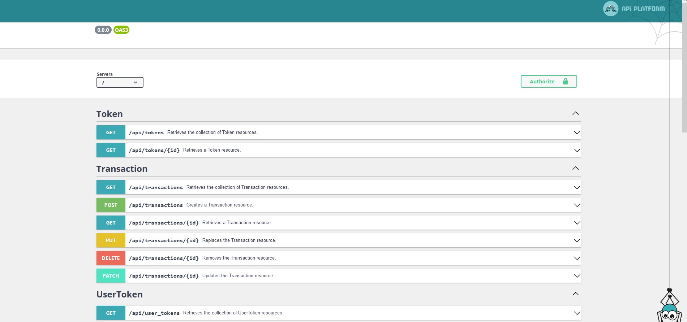

How to (re)create THIS repository from scratch
==============================================

## Create project

Open a terminal in your directory project.

```shell
# Create a new symfony project:
# - using the last symfony version available
# - with php8
# - inside a directory called crypto-tracker-recreate.
symfony new --webapp --php=8.0 crypto-tracker-recreate
# Move inside crypto-tracker-recreate.
cd crypto-tracker-recreate
```

If you want to ask for a specific symfony's version on `new`, you have to add the option `--version=x.y`. Where `x.y` is
the version you want. 

e.g.:
```shell
# Create the project with symfony v5.4
symfony new --webapp --php=8.0 --version=5.4 crypto-tracker-recreate
```

## Set php version for the project

If not exist, create a new file `.php-version` with this code inside:
```
8.0
```
It will tell to Symfony CLI to use php 8.0 for this project.

## Create `.env.local`

Create the file `.env.local` and configure your info for database connection. Take a look at `.env` file, where you can
find `DATABASE_URL`.

More info about environment files here: [https://symfony.com/doc/current/configuration.html#configuration-based-on-environment-variables](https://symfony.com/doc/current/configuration.html#configuration-based-on-environment-variables).

!!! WARNING !!! DO NOT EDIT DIRECTLY YOUR `.env` FILE DIRECTLY.

## Install & configure api dependencies.

Install [API Platform](https://api-platform.com/docs/core/getting-started/) and some small other deps.

```shell
symfony composer require api
```

If you want to customize some global config for your API, you can do it inside `config/apackages/api_platform.yaml`. To
know what you can add/set inside this file, take a look at [this documentation](https://api-platform.com/docs/core/configuration/).

## Create your entities.

Now, you can add your entities to the project. To do that, you can use this command to create and edit entities:

```shell
symfony console make:entity
# or
symfony console make:entity YourEntity
```

Take time to read what will be printed in the terminal, if you answer the questions, Symfony will generate your entity.
To ease the process, first create all your entities WITHOUT association/relation, only with basic properties. In a
second time, you can add associations.

The maker will ask you if you want to make this new entity as an `ApiResource`.

## Update existing entities

If you have existing entities that were created BEFORE adding `api-platform`, you can manually add this code on your
entities to make them available to the API.

```php
<?php

namespace App\Entity;

// ...
use ApiPlatform\Core\Annotation\ApiResource;
// ...

// ...
#[ApiResource]
class YourEntity
{}
```

## Update database.

After you finished the creation or edition of your entities, you have to update your database to match your entities:
```shell
symfony console make:migration
```
This command compare what is already in your database and the current state of your entities, then it will generate a
file migration located in `migrations/` directory.

After your migration file have been created, you need to update the database itself with this command:
```shell
symfony console doctrine:migration:migrate # short d:m:m
```

Each time you update some fields in your entities, you need to run those two commands.

## Remove some API actions/operations

On your entity, you can list actions you want to have:

```php
use ApiPlatform\Core\Annotation\ApiResource;

#[ApiResource(
    collectionOperations: ['get'],
    itemOperations: ['get'],
)]
```

In this example, only GET actions for item and collection are kept. See [Operation docs](https://api-platform.com/docs/core/operations/)
for more info.

## Generate fixtures

Using the [AliceBundle](https://github.com/theofidry/AliceBundle) to integrate [Faker](https://fakerphp.github.io/)
and [Alice](https://github.com/nelmio/alice) libraries into our project.

### Install

```shell
symfony composer require hautelook/alice-bundle --dev
```

After install, a new directory `fixtures/` will be automatically created. Your will write your fixtures inside.

For more example, take look at this repository `fixtures/` directory and the docs like bellow:
- [Basic YAML fixtures](https://github.com/nelmio/alice/blob/master/doc/complete-reference.md#creating-fixtures)
- [Optional data & unique constraint](https://github.com/nelmio/alice/blob/master/doc/complete-reference.md#optional-data)
- [List of formatters](https://fakerphp.github.io/formatters/numbers-and-strings/) (functions you can use to generate fake data)
- [Reference another fixture](https://github.com/nelmio/alice/blob/master/doc/relations-handling.md)

Once you finished your fixtures, use this command to populate your database with it.

```shell
symfony console hautelook:fixtures:load --purge-with-truncate
```

## Finished

Now you can open your browser and go to [https://localhost:8000/api](https://localhost:8000/api).

If you have not enable HTTPS, use this link instead [http://localhost:8000/api](http://localhost:8000/api) or follow
the instructions write in your terminal to enable it for all your projects.

You will have something looking like this below:


